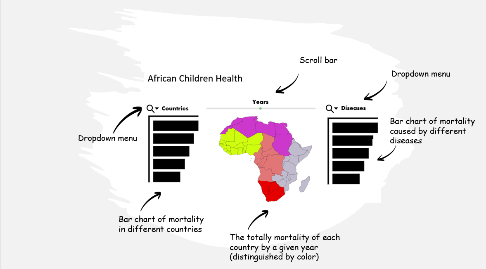
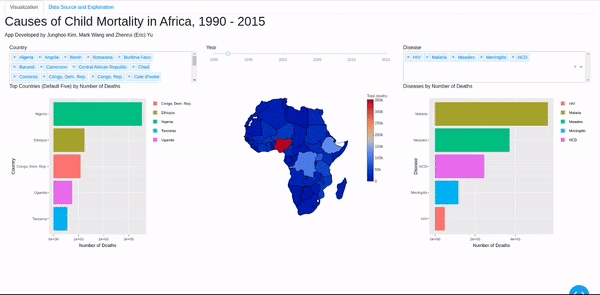

# dsci_532_group_24-R

# Care for African Kids

## Welcome!

This document is to provide a brief overview about our project. Please feel free to jump straight to one of the sections below:

- [Motivation](#motivation)
- [Description of app](#description-of-app)
- [Initial app sketch](#initial-app-sketch)
- [Dashboard in action](#dashboard-in-action)
- [Link to deployed app](#link-to-deployed-app)
- [Get involved](#get-involved)

## Motivation

The ongoing COVID-19 crisis has highlighted some of the drastic consequences arising from inequalities in access to healthcare among nations, ethnicities, and social classes. Although this global crisis has exposed many of the shortcomings of the healthcare systems that exist even in wealthy countries, there are well-documented reports of the need to address preventable child deaths in Africa. 

Although there has been significant progress in reducing preventable child deaths between 1999 and 2019, [2020 WHO fact sheet on improving children survival and well-being](https://www.who.int/en/news-room/fact-sheets/detail/children-reducing-mortality) discusses the prevalence of child mortality that persists in Sub-Saharan Africa, which accounts for the highest child mortality rate in the world. For example, in 2019, 86 out of 1000 newborns in The Democratic Republic of the Congo, a nation with 86.79 million people, do not make it to their fifth birthday. In Chad, the number is as high as 117. By contrast, about 99.6% (996 in 1000) of Canadian newborns are still alive when they are five years old. As internal data analysts for an international non-governmental organization (INGO), we are dedicated to using data to understand infant and child mortality across the African continent. 

We will explore, analyze and present the diseases responsible for infant and child deaths in Africa, and produce a data dashboard for both internal and external use. We believe that our work will inform our organization's leadership about where in Africa we should focus our resources, and what disease-specific measures, e.g. medications and vaccines, we should focus on in different countries. Specifically, we aim to understand the following questions: 

 - Which countries in Africa have the most severe infant and child mortality problem? How has each country's situation changed over time?
 - Among major diseases, what are the main causes of infant and child mortality? How has the severity of each cause changed over time?

Furthermore, we also expect the dashboard to be published for a larger audience of donors, government partners and receiver countries. Users of our data dashboard will be able to select the country, year or disease type that they are interested in. This will help them make more informed and targeted decisions. 

## Description of app

While working with rich Gapminder datasets will help us provide a wealth of information to our app users, we may end up with over-plotting and clutter in data visualization if we are not careful. We aim to reduce visual clutter as much as possible by providing an intuitive user interface and simple visualization layout.

There will be a horizontal interface at the top of the page consisting of (1) drop-down menu with checkboxes where users can select multiple countries, (2) slider to view the shift in data across different years, and (3) drop-down menu where users can select different diseases. 

The visual components include the map of African continent at the centre and two sorted bar plots, one on each side of the map. The map will serve 2 purposes: (1) it provides the geographical information to the user, who may be interested in the proximity of different countries to each other (e.g. shipping medical supplies to multiple countries), and (2) it provides a heat map for child mortality.
 
To the left of the map, there will be a bar chart displaying the total child mortality for each country, accounting for all diseases selected by the user, ranked in the descending order; similarly, to the right of the map, there will be a bar chart displaying the total child mortality for each disease, accounting for all countries selected by the user, ranked in the descending order. 

The interactive and visual components of the app are entangled with each other in a way that is most intuitive to help user experience. Changing any of the three interactive components (e.g. unselecting a disease) will affect all three of the visual components. However, users will still find it easy to find a specific interactive component, since the location of the interactive component will be closest to the visual component it affects the most. For instance, drop-down menu for the countries will be located just above the bar chart that ranks the countries with the highest mortality; slider for the year will be located just above the map, since changing the years using the slider will likely have the highest impact on the color encoding displayed on the map.

## Initial app sketch

## Dashboard in action

## Link to deployed app

We hope we caught your interest by now! Please check out the [latest version](https://african-children.herokuapp.com/) of our app, courtesy of Heroku.

## Get involved
If you would like to help us improve our app, please check our [contributors' guidelines](CONTRIBUTING.md) !

Please note that it's very important for us to make sure that everyone who wishes to participate in the project feel positive, safe, and welcomed. We ask that you follow our [code of conduct](CODE_OF_CONDUCT.md) in all interactions, both online and offline.

